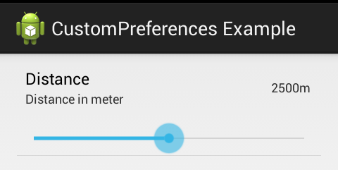

# CustomPreferences

This is a Custom Preference library for Android (API8-API17).

Features:

* SeekBarPreference
* there's more to come

It's still work in progress, but should already be usable :)

It's provided for free without any warranty, in the hope it might be useful. 
If you are using it in your project don't hesitate to leave a message.

## SeekBarPreference
Just another SeekBarPreference.

The SeekBar Preference shows a SeekBar directly on the PreferenceScreen.
Its inspired by [Robobunny's SeekBarPreference](http://robobunny.com/wp/2011/08/13/android-seekbar-preference/), but without using a own layout.
Well there is some layout in there, but it will reuse the default Preference layout. It crates a vertical LinearLayout adds the default Preference layout and the SeekBar.
This provides a nice integration into different Android versions, since the default layout isn't changed.

### Usage

To use SeekBarPreference you have to checkout this repository and include it as library in your Android project.

To define a SeekBarPreference you have to put it, like regular Preference, in your preferences xml file.

	<PreferenceScreen xmlns:android="http://schemas.android.com/apk/res/android"
		xmlns:custom="http://schemas.android.com/apk/res-auto">
    
		<de.nware.custompreferences.SeekBarPreference
			android:key="distance"
			android:title="Distance"
			android:summary="Distance in meter"
			android:defaultValue="2500"
			custom:max_value="5000"
			custom:unit_symbol="m"  
		/>
	</PreferenceScreen>

This should produce something like that. (on Android 4.2)

For the custom attributes you need to assign a namespace, see ``xmlns:custom``.
It must be set to ``http://.../res-auto`` if you are using it as a library otherwise you have to use the packagename (and don't forget to copy ``attrs.xml``).

The available attributes are the following:

*	``min_value`` is optional, could be + or -, default is 0
*	``max_value`` is mandatory, it defines the maximum, has to be greater than ``min_value``
*	``unit_symbol`` is optional, shows a unit symbol behind the current value

